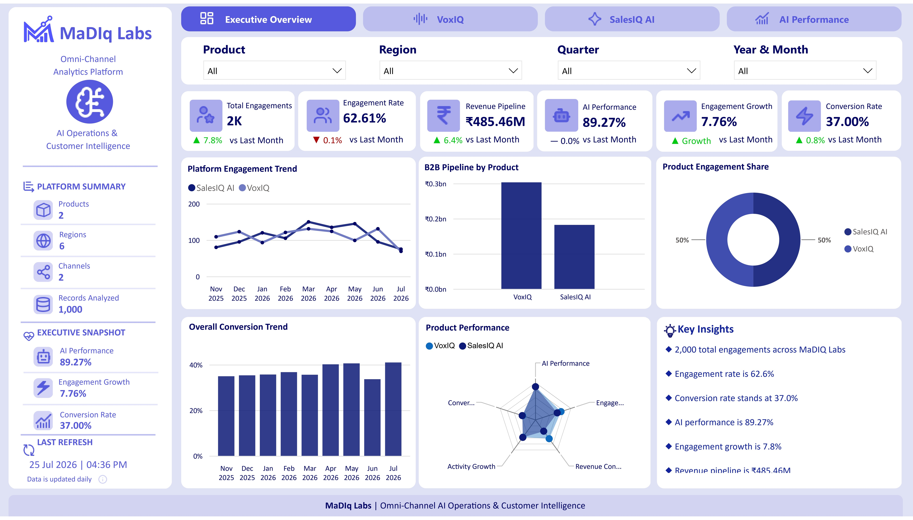
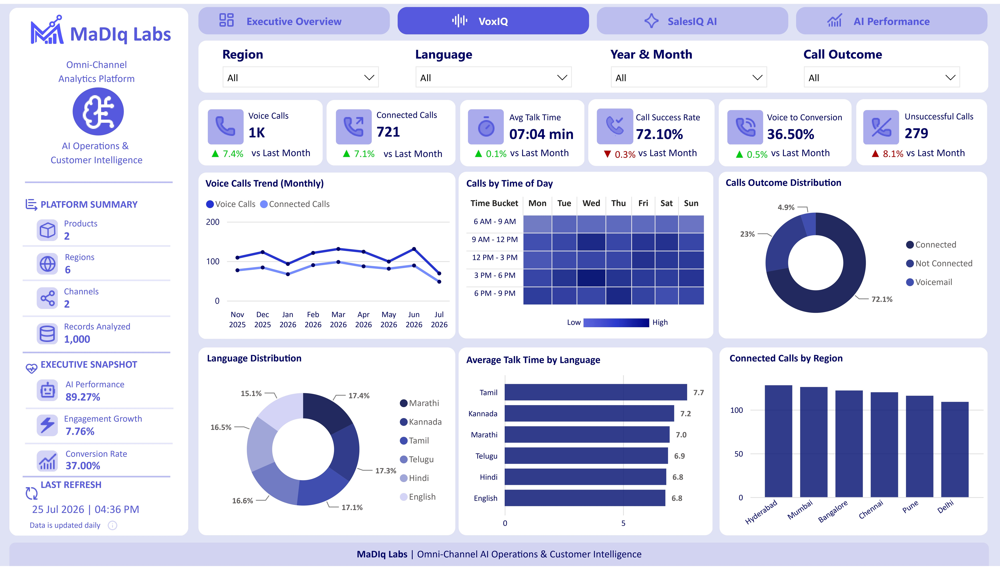
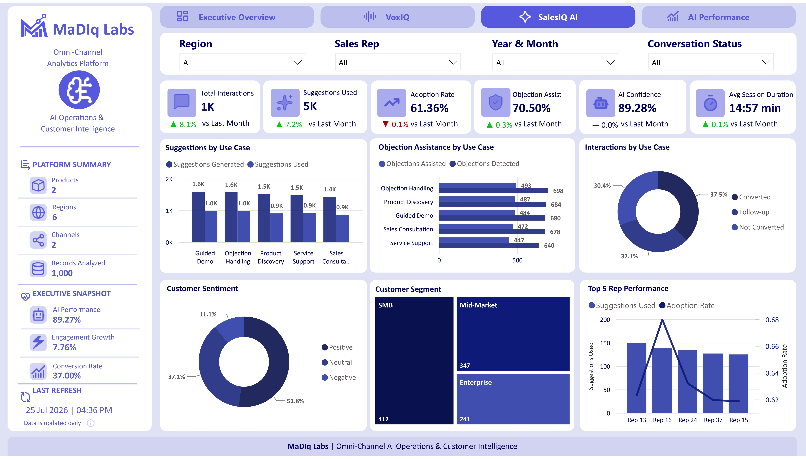
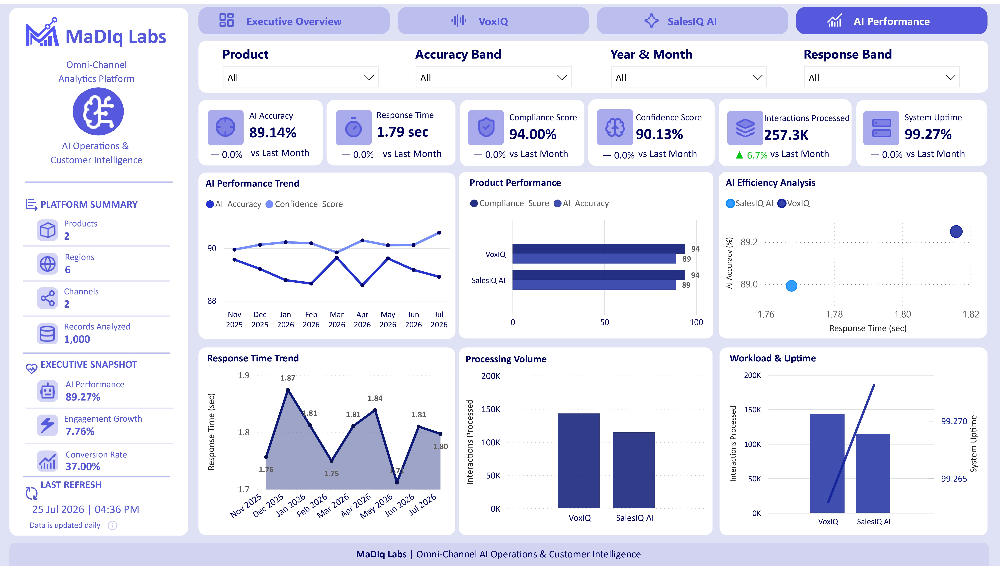

# MaDIq Labs — Omni-Channel Analytics Dashboard

A Power BI portfolio project built to explore how business, voice, sales interaction, and AI performance data can be brought together into one interactive analytics platform.

> **Note:** This is a personal portfolio project built using synthetic data and fictional company/product information.

## Dashboard Preview

### Executive Overview


### VoxIQ — Voice Analytics


### SalesIQ AI


### AI Performance


## Project Files

- [Power BI Dashboard](<dashboard/MaDIQ Labs Omni-Channel Analytics Dashboard.pbix>)
- [Dashboard Explanation](<documentation/MaDIq Labs Dashboard Explanation.pdf>)
- [Technical Documentation](<documentation/MaDIq Labs Technical Explanation.pdf>)
- [Synthetic Datasets](datasets/)

> The `.pbix` file can be downloaded and opened using Power BI Desktop.

## Project Overview

I built this project in my free time to go beyond individual Power BI charts and work through the complete dashboard development process.

The dashboard is designed around a fictional company, **MaDIq Labs**, with two products:

- **VoxIQ** — Voice analytics solution
- **SalesIQ AI** — AI-assisted sales interaction solution

The report contains four connected analytical pages, moving from an executive-level view into operational and technical analysis.

## Dashboard Pages

### 1. Executive Overview

Provides a consolidated view of platform performance.

Key areas include:

- Total Engagements
- Engagement Rate
- Revenue Pipeline
- Conversion Rate
- Engagement Growth
- AI Performance
- Monthly engagement and conversion trends
- Product engagement share
- Product performance comparison
- Dynamic key insights

Filters allow analysis by **Product, Region, Quarter, and Month**.

### 2. VoxIQ — Voice Analytics

Focuses on voice/call operations.

Key areas include:

- Voice Calls
- Connected Calls
- Call Success Rate
- Voice-to-Conversion Rate
- Average Talk Time
- Unsuccessful Calls
- Call outcome distribution
- Time-of-day analysis
- Language analysis
- Regional performance

A day/time heatmap was also created to understand when call activity is highest.

### 3. SalesIQ AI

Analyzes AI-assisted sales interactions and adoption.

Key areas include:

- Total Interactions
- Suggestions Used
- Adoption Rate
- AI Confidence
- Objection Assistance
- Average Session Duration
- Suggestions by use case
- Objection handling
- Customer sentiment
- Customer segments
- Sales representative performance

### 4. AI Performance

Focuses on the technical performance of the platform.

Key areas include:

- AI Accuracy
- Response Time
- Compliance Score
- Confidence Score
- Interactions Processed
- System Uptime
- Accuracy and confidence trends
- Product-level performance
- AI efficiency analysis
- Processing volume
- Workload vs uptime

## Data Preparation

The source data was prepared and transformed using **Power Query**.

The preparation process included:

- Loading multiple source datasets
- Promoting and standardizing headers
- Assigning appropriate data types
- Cleaning categorical fields
- Preparing date and datetime fields
- Creating fields required for time-based analysis
- Standardizing product and business terminology
- Validating records before building the reporting layer

## Data Modelling

The Power BI model uses shared dimensions such as:

- Date
- Product
- Region

These dimensions provide consistent filtering across different areas of the dashboard.

Supporting/helper tables were also used where required for custom visual behaviour and multi-metric comparisons.

## DAX & Calculations

Reusable DAX measures were created instead of relying only on visual-level calculations.

Some of the areas covered include:

- Engagement metrics
- Conversion metrics
- Revenue pipeline
- Voice performance
- Sales interaction adoption
- AI performance
- Previous-month calculations
- Month-over-Month comparisons
- Dynamic product comparisons
- Dynamic text-based key insights

Functions used include:

`CALCULATE` · `DIVIDE` · `DATEADD` · `SELECTEDVALUE` · `SWITCH` · `REMOVEFILTERS` · `FORMAT`

## Dashboard Features

- Interactive slicers
- Cross-filtering
- Month-over-Month KPI comparisons
- Dynamic key insights
- Multi-metric product comparison
- Time-of-day heatmap
- Customer segmentation
- Sales representative analysis
- AI efficiency analysis
- Consistent navigation across four report pages

## Challenges & Learnings

One of the most useful parts of this project was handling calculations under different filter contexts.

Some measures initially worked at the overall level but behaved differently when product, region, language, or date filters were applied.

Working through these cases helped me understand:

- DAX filter context
- Time intelligence
- Disconnected/helper tables
- Visual interactions
- Measure debugging
- Data validation
- The difference between creating a chart and building a usable analytical report

## Tools & Technologies

- **Power BI Desktop**
- **Power Query**
- **DAX**
- **Data Modelling**
- **Data Visualization**
- **KPI Development**
- **Time Intelligence**
- **Data Validation**

## Repository Structure

```text
madiq-labs-omnichannel-analytics/
│
├── README.md
│
├── dashboard/
│   └── MaDIQ Labs Omni-Channel Analytics Dashboard.pbix
│
├── screenshots/
│   ├── 01_Executive_Overview.png
│   ├── 02_VoxIQ_Analytics.png
│   ├── 03_SalesIQ_AI.png
│   └── 04_AI_Performance.png
│
├── dataset/
│   ├── Automation Events.csv
│   ├── CRM Updates.csv
│   ├── Customer Calls.csv
│   ├── Field Sales.csv
│   ├── SalesIQ AI Interactions.csv
│   └── AI Performance Logs.csv
│
└── documentation/
    ├── MaDIq Labs Dashboard Explanation.pdf
    └── MaDIq Labs Technical Explanation.pdf
```

## Documentation

Detailed documentation is included in the repository covering:

- Dashboard and business explanation
- Technical implementation
- Data preparation
- Data modelling
- KPI logic
- DAX approach
- Visualization decisions

## Disclaimer

This project was created for **learning and portfolio purposes**.

**MaDIq Labs, VoxIQ, and SalesIQ AI are fictional names. All data used in the public version of this project is synthetic/demo data and does not represent the operations or performance of any real company.**

## About Me

**Nadukuru Madhav Mukesh**

Data Analytics | Business Intelligence | Power BI | SQL | Python

LinkedIn: [linkedin.com/in/n-madhavmukesh](https://www.linkedin.com/in/n-madhavmukesh/)
